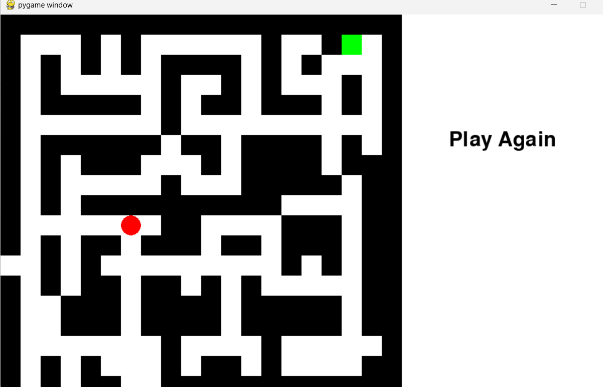

# MazeGame
DFA usage

  

## Project Overview
Maze Game is an interactive game where players navigate through a maze to reach a specified goal. The player can move through the maze using keyboard controls and must avoid walls.

## Technologies Used
- **Python**: The main programming language for the game.
- **Pygame**: A set of Python modules designed for writing video games, providing functionalities for graphics, sound, and input handling.
- **Graphviz**: Used for creating visual representations of the game's state transitions.

## Getting Started
To run the Maze Game, make sure you have Python and Pygame installed. You can install Pygame using pip:

```bash
pip install pygame
pip install graphviz
